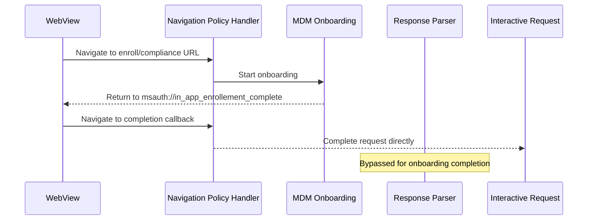
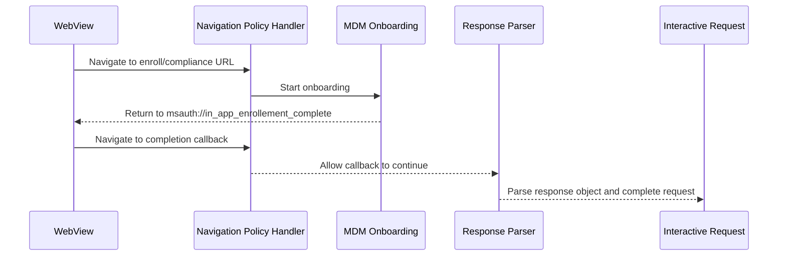

# MDM Onboarding Approach Comparison

## Context

During interactive auth, web content can trigger MDM onboarding endpoints (for example `enroll` or `compliance`).
We need to:

1. Intercept onboarding navigation at webview policy/navigation time.
2. Complete onboarding through a fixed callback URL.
3. Let completion continue through normal response-object parsing.

The completion callback URL is:

`msauth://in_app_enrollement_complete`

## Approach A1: Handle completion fully in navigation policy layer

- Intercept `enroll`/`compliance` URL navigation in the webview policy callback.
- Start device onboarding flow.
- Intercept `msauth://in_app_enrollement_complete` in policy callback.
- Complete request directly from policy handler.

### A1 diagram

## Approach A2: Intercept onboarding at navigation time, complete via response parsing

- Intercept `enroll`/`compliance` URL navigation in the webview policy callback.
- Start device onboarding flow.
- When onboarding returns to `msauth://in_app_enrollement_complete`, allow this callback to propagate.
- Parse the completion callback via response-object parsing and finish on the normal auth response path.

### A2 diagram

## Comparison

| Category | A1 | A2 |
|---|---|---|
| Intercept `enroll`/`compliance` | Yes (navigation-time) | Yes (navigation-time) |
| Completion callback URL | `msauth://in_app_enrollement_complete` | `msauth://in_app_enrollement_complete` |
| Completion location | Policy callback | Response-object parser |
| Consistency with existing auth completion | Lower | Higher |
| Risk of special-case logic drift | Higher | Lower |

## Final decision

Use **A2**:

- Keep onboarding start interception in navigation policy for `enroll` and `compliance`.
- Use `msauth://in_app_enrollement_complete` as the onboarding completion callback.
- Allow completion to propagate to response-object parsing so request completion stays on the standard path.
